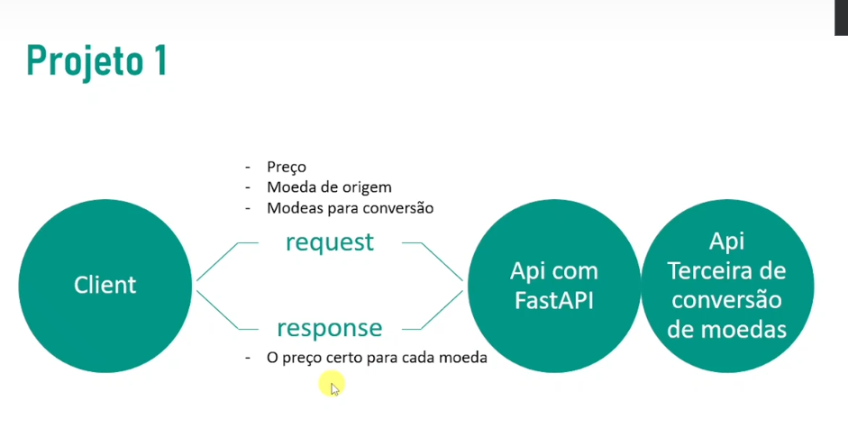

DESAFIO 1

MONTE UM CONVERSOR DE PREÇOS ONDE PEGA O VALOR DE UM DETERMINADO PRODUTO E CALCULE
O VALOR QUE O PRODUTO DEVE SER VENDIDO EM OUTRA MOEDA

EX: 
    PRODUTO CUSTA 80,00 BRL
    PARA USD CUSTARIA 15.69 USD

